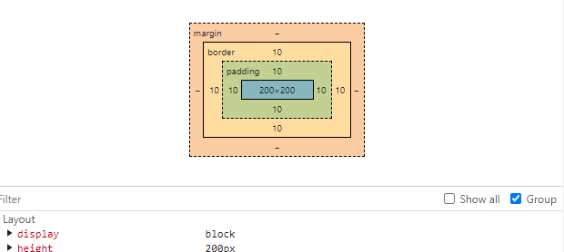
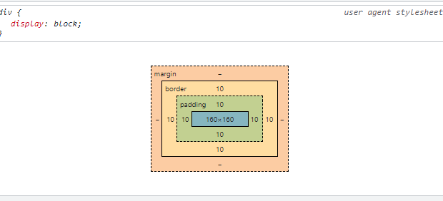
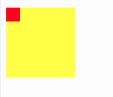
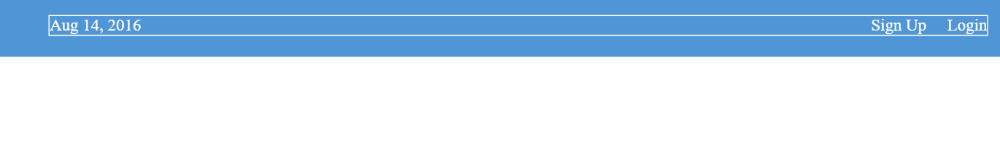

# CSS Introduction

Cascading Style Sheet (CSS) merupakan instruksi penulisan untuk mengatur tata letak dan penampilan document HTML. Dengan adannya Bantuan CSS sebagai pengelola tampilan dari document akan sangat mempermudah penulis menciptakan karyanya. 

Beberapa Fitur CSS:
1. Mengubah warna text maupun background
1. Mengubah ukuran gambar atau text
1. Membuat animasi atau effect
1. Mengatur penempatan object
1. Memberikan border

## Mengenal CSS syntax
CSS snytax merujuk kepada format aturan dalam pembuatan style. CSS Syntax berisi deklarasi, properties, dan Selector

## Cara menghubungkan css dengan document html
Ada tiga cara untuk menghubungkan CSS kedalam document HTML:
1. Inline Style Sheet
Menulis code CSS tepat didalam object yang dituju.
Contoh `<p style='color:red;'> </p>` 
2. Embedded Style sheet
Menulis code CSS didalam TAG HEAD.
contoh:

```
<head>
<style>
p {color: 'red';}
</style>
</head>
```
3. External CSS
Link menuju tempat penyimpanan CSS kita, ditulis didalam TAG `<head>`.
`<link href='style.css' rel='stylesheet'>`


## CSS Property 
```
p {
    color: red;
}
```

Pada kode diatas, "p" adalah element selector atau disebut selector. Sedangkan "color" adalah property. property adalah yang memberikan instruksi bagian mana dari selector tersebut berubah secara visual. 
  
## Menggenai Id

Konsep dari attribute id itu sama dengan attribute class, kita dapat menlakukan perubahan pada tampilan mereka.

Tetapi jika ada id dan class yang memiliki style berlawanan maka, style dari id yang akan dipakai.


Dibawah ini adalah contoh mendifinisikan id pada css, dan melakukan pengaturan style:
```
#div-main {
  background-color: white;
}
```

## Menggenai padding


pada pengaturan ukuran element terdapat setidaknya tiga property dasar: padding, border, dan margin.

Kita mulai dari padding, padding adalah jarak dari content didalam element ke bagian border.
``` padding: 1px 1px 1px 1px;```

Border adalah batas luar dari content. Kita dapat melihat border, dengan mendefinisikan border ke dalam element tersebut. 
``` border: 1px solid red; ```

Sedangkan margin adalah jarak antara element satu dengan yang lainnya.
```margin: 1px 1px 1px 1px;```

Dibawah ini adalah format untuk value padding dan margin:

```
padding: 40px 20px 20px 40px;
  // Format penempatan : padding-top, padding-right, padding-bottom, and padding-left
```


## CSS Selectors

Untuk mempermudah kita dalam melakukan configurasi tampilan halaman, kita bisa mengunakan fungsi *CSS Selector*. 

Dimana kita sebagai brainware / developer, cukup mendefinisikan nama element di dalam style css, lalu melakukan configurasi disana.

Sebagai perumpamaan: 
Terdapat sebuah perumahan yang beriisi banyak blok dan setiap blok memiliki aturan pewarnaan bangunan sendiri-sendiri.
Sebagai contoh blok A terdiri dari bangunan yang memiliki dominan warna merah, sedangkan blok B terdiri dari bangunan yang memiliki dominan warna biru.

Disini adalah pertanyaan nya!

Terdapat seorang kurir yang bertanya kepada kita, Seperti apa penanda bangunan untuk blok B?

Jawaban:

a. kita menjawab dengan memberitahui warna dominan pada blok B.
b. Kita menjawab dengan memberitau blok B berada di dekat blok A.

Penyelesaian:
Jika jawaban kita adalah a. maka itu benar.
Karena konsep dari css selector adalah menuliskan alamat tujuan dari element yang kita tuju (https://developer.mozilla.org/en-US/docs/Web/CSS/CSS_Selectors?retiredLocale=id).

## Attribute selector
  
```
/*ini akan mendefinisikan alamat yang didalam attribute class terdapat kata "link" */

[class~="link"] {
  margin: 20px 0px 20px 0px;
}
```


## CSS Box Model 

Didalam Sebuah Element HTMl itu terdiri dari:
- Content - Adalah area utama dimana jika kita menuliskan suatu text, text tersbut berada didalam contetn
- Padding - Adalah area kosong yang menjadi jarak antara content dengan border / bagian tepi element 
- Border - Adalah bagian tepi dari  suatu element. Berada diantara padding dan margin 
- Margin - adalah bagian luar dari border. Yang memberi jarak antara element satu dengan yang lainnya

## Box-sizing:border-box

"box-sizing: border-box" adalah salah satu properti css yang dapat digunakan untuk mengatur box model dalam suatu element HTML. Secara simple "border-box" adalah digunakan untuk memastikan tinggi dan lebar dari element sesuai dengan keingginan kita. 

Cerita:
- Pada dasarnya element akan memiliki tipe "box-sizing: content-box", yang dimana ukuran element akan dihitung berdasarkan ukuran kontent ditambah padding dan border, Sehingga jika kita menambahkan padding atau border ukuran total element akan membesar. 

- Jika "box-sizing: border-box" mereka akan mengatur agar ukuran lebar dan tinggi sesuai dengan spesifikasi yang sudah kita tulis.

Pada dasarnya box model mengunakan  perhitungan nilai width x height pada element sperti berikut
```
Width = width + left padding + right padding + left border + right border

Height = height + top padding + bottom padding + top border + bottom border
```
src: https://medium.com/@elelvyra/learn-css-box-model-dan-box-sizing-6b19a367478d#:~:text=Box%20sizing%20adalah%20properti%20yang,width%20dan%20height%20suatu%20elemen.

Mari kita coba untuk membuat box model terlebih dahulu, dengan width 200 px, height 200px, padding kanan-kiri 20px, padding atas-bawah 20px, border kanan-kiri 20px, dan border atas-bawah 20px.

mari kita hitung dengan cara diatas
```
width = 200 + 10 + 10 + 10 + 10 = 240
height = 200 + 10 + 10 + 10 + 10 = 240
```
Total width adalah 240 dan juga height nya. Ada cara jika kita ingin menghasilkan 200px tersebut adalah keseluruhan dari 
width dan height, yaitu menambahkan property `box-sizing: border-box;`. **border-sizing** akan mengatur agar lebar atau tinggi dari element tersebut sesuai dengan ukuran width dan height yang sudah ada. 

Mari kita lihat ukuran total pada gambar sebelum box-sizing.



Jika semisal Kita menambahkan property box sizing seperti code dibawah

```
div.main {
        width: 200px;
        height: 200px;
        background-color: green;
        padding: 10px;
        border: 10px solid black; 
        box-sizing: border-box;
      }
```

hasilnya akan menjadi Seperti gambar dibawah. `box-sizing: border-box` akan membuat komputer mengatur secara otomatis pembagian dari width dan height untuk membuat hasil total tidak lebih dari yang sudah dideklarasi kan



## CSS float

Untuk source code bisa dilihat disini: https://replit.com/@SayaManusia/CSS-Floats#index.html

Float adalah property css yang dapat membantu anda untuk mengatur agar element bisa bergerak secara horizontal.
Float tidak hanya untuk mengatur arah gerak element, float akan membuat element disekitarnya bisa berada didalam area element float, tidak bergerak dibawah dari element float 

Seperti pada digambar dibawah ini. Kotak kecil berwana merah memiliki property float, tetpai kotak kuning besar tidak memiliki float. Maka kotak kuning besar akan berjalan dibawah kotak merah. 




Ada tiga value float yang sering dipakai: 
1. right
2. left 
3. none, Akan menggubah ke tempat default 

cara penggunaan `float: left;`

dan ada tiga cara yang biasaanya digunakan untuk memindahkan element

1. `float: left;` untuk memindahkan ke area kiri
2. `margin: 0 auto;` Untuk memindahkan ke area tengah
3. `float: right;` untuk memindahkan ke area kanan 

## HTML document Tree 
http://web.simmons.edu/~grabiner/comm244/weekfour/document-tree.html#:~:text=Parent%20and%20Child,element%20in%20the%20document%20tree.


## Flexbox

Untuk melihat source code kecil menggenai flexbox: 
[flexbox src](../code/flexbox-test)

Flexbox  memiliki kemiripan dengan float, tetapi disini kita bisa mengatur penuh tata letak element. Mulai dari Posisi, urutan, garis arah dan ukuran dari element. 

Untuk memahami penggunaan dari float dan flexbox. Flexbox memiliki fungsi yang lebih lengkap daripada float, flex akan bisa bekerja jika ada minimal "parent", "child" element. Flexbox sangat disarankan jika ingin mengatur bagian yang besar pada website. 

Sedangkan float akan dipakai pada element kecil pada halaman website, yang tidak memerlukan fungsi kompleks. 

Istillah bagian kecil float pada halaman  website adalah **Magaine-style  layouts**
istilah bagian besar yang ditanggani oleh flexbox adalah  **overall page structure**
src: https://www.internetingishard.com/html-and-css/flexbox/

Pada Flexbox ada dua tipe box yang perlu kita pahami, yaitu "flex container" dan "flex items". element HTML yang ada didalam element container itu disebut sebagai item. Kita bisa mengatur setiap item secara individu, tetapi sebagian besar tergantung dengan container untuk mengaturnya bagaimana. 

Untuk menggunakan flexbox, kita harus menambahkan property `display: flex;` kedalam container, karena jika tidak maka semua property flexbox tidak akan dibaca oleh komputer. 

FLex vontainer hanya memperhatikan posisi element yang berada di satu level dibawahnya ( element didalam dari container adalah item ). Container tidak akan mengatur element yang berada didalam item.

Untuk melakukan customisasi pada element pada  bidang horizontal, kita akan memakai property `justify-content` 
ini akan membantu untuk memindahkan element, dan mengatur jarak antar item. 

value yang bisa dipilah pada property justify-content:

- Center  - akan membuat element berada di tengah
- Flex-start - akan memindahkan element ke bagian kiri 
- Flex-end - akan memindahkan element kebagian kanan 
- Space-between akan memberikan jarak antar element saja, tidak termasuk border
- space-around akan memberikan jarak antar element dan border 


Untuk mengelompokan element pada flexbox, kita cukup buat flexbox lagi didalam container, seperti code dibawah ini
```

<div class='menu-container'> <!-- This is main container-->
        <div class='menu'> 
            
            <div class='date'>Aug 14, 2016</div>    <!-- main container item -->
            <div class='links'>                     <!-- This is second container -->
                <div class='signup'>Sign Up</div>   <!-- second container item -->
                <div class='login'>Login</div>      <!-- second container item -->
            </div>
        
        </div>
    </div>
```



Flexbox juga dapat mengatur pergerakan elementdalam bidang  vertikal, dengan menggunakan property `align-items`.

Beberapa value yang terdapat pada alig-items:

- Center - mengatur posisi item ke tengah 
- flex-start - akan mengatur element ke bagian atas container 
- flex-end - akan mengatur elemet ke bagian bawah container 
- stretch- akan mengatur element menjadi memanjang kebawah


## CSS Grid

CSS grid adalah suatu sistem layout dua dimensi pada website, sama seperti flexbox. 

Sistem layout design berfungsi untuk mengontrol pergerakan, ukuran, dan penempatan pada element. Dengan CSS grid kita dapat membuat aturan dalam penempatan element di dalam website.

Penggunaan yang baik untuk grid adalah untuk mengatur bagian kecil pada website. Sedangkan element induk yang mencakup element kecil-kecil dikonfigurasi oleh Flexbox.

## CSS transform and transition
Adalah suatu protokol untuk melakukan perubahan secara visual yang terdapat pada element web. Kedua transformasi tersebut melakukan bentuk animasi tanpa harus menggunakan javascript.

- CSS Transform
fungsi ini digunakan untuk memanipulasi bentuk visual dari element, dengan cara mengubah posisi, ukuran, rotasi, dan persepktif. Sebagai contoh element akan berotasi sesuai dengan berapa derajat yang diinginkan. 

- CSS Transition
fungsi ini akan membantu dalam melakukan perubahan kondisi dari element. anda juga dapat menjelaskan detail seberapa cepat durasi effek, dan sebagainnya. 
contoh efek transition adalah mengubah ukuran visual dari element.
Referensi: https://www.w3schools.com/css/css3_transitions.asp

***
# Cheatsheet area
#### Contoh code CSS
`p { color: red; }`
- `p` CSS akan mengambil object bernama 'p' dari HTML.
- `color` membuat fungsi untuk memilih warna. jika tidak ada 'color' maka warna yang dipakai adalah default.
- `red` memilih warna merah.


#### Refrensi
- https://id.wikipedia.org/wiki/Cascading_Style_Sheets
- https://www.w3schools.com/css/css_howto.asp
- https://www.freecodecamp.org/


