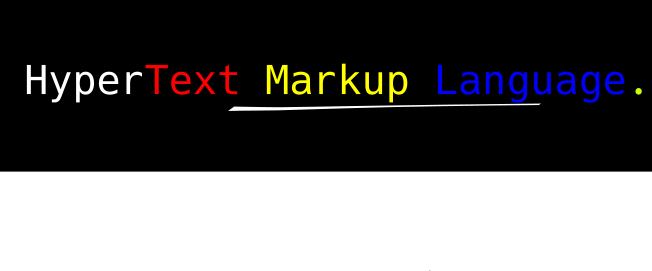

## Pengenalan



HTML ( HyperText Markup Language )  adalah suatu instruksi untuk menulis document agar bisa ditampilkan ke dalam web browser. web browser akan mengambil file HTML dari penyimpanan local dan akan diubah menjadi halaman website.

Dalam Pembuatan website terdapat setidaknya 3 komponen Pembangun:

- Kerangka tubuh: HTML
- Fungsi Tubuh: JavaScript
- Bagian paling luar tubuh : CSS

Secara garis besar kita dapat bayangkan HTML adalah bagian yang akan menjadi penompang dari text dan gambar, JavaScript adalah bagian yang menghasilkan suatu respon akan sesuatu, dan CSS adalah bagian yang akan mengatur tampilan mereka.

## Agar dapat menguasai 

Dalam penggunaan html, css terdapat opsi untuk menggunakan framework untuk mempercepat proses pembuatan. 
bagi yang baru mulai belajar diharapkan jangan terlalu mengandalkan framework dalam pembuatan halaman website karena itu akan menghasilkan kebiasaan yang buruk dalam problem solving (Programing Unpas).

Contoh mudahnya: Dalam matematika terdapat banyak trick cepat dalam penyelesaian suatu masalah, akan tetapi itu tidak baik karena jika ketemu masalah yang berbeda akan menjadi sulit nanti.

Bagi yang masih belum tau Framework. Framework adalah adalah bentuk pondasi yang telah jadi dalam membangun sistem. 
Dengan framework kita tidak perlu membangun sistem sepenuhnya dari awal (https://www.codecademy.com/resources/blog/what-is-a-framework/#:~:text=A%20framework%20is%20a%20structure,you%27re%20building%20a%20house.).

Selain itu kita juga harus berani mencoba dan berlatih dalam pembuatan website. Sebuah kesalahan dalam berusaha adalah hal yang mutlak tidak ada yang bisa lari dari itu. Oleh karena itu jika ingin menguasai Pembuatan website maka harus berani mencoba.

## Peralatan membantu

Dalam Pemrograman seperti website diperlukan alat untuk membantu pembuatan website. Alat tersebut terkadang berbentuk sabagai hardware maupun software.

Tetapi perlu kita wajib pahami adalah sebuah alat hanyalah alat, yang terpenting adalah brainware yang akan menggunakan alat tersebut. 

Contoh software yang sering digunakan adalah:
- Vscode
- Atom text editor
- Notepad ++

Software Browser:
- Google Chrome
- Opera
- Mozila Firefox

Hardware Pendukung:
- Monitor dengan minimal resolusi 1920 * 1080
- 2 Monitor untuk mempermudah pengerjaan

Dalam pengerjaan halaman website alangkah baiknya untuk membuka halaman website dan text editor secara continue. Setiap kali kita telah melakukan perubahan bisa langsung di lihat hasilnya di web browser. 

## Structur HTML

Dalam pembuatan style document website, terdapat suatu structur yang paling populer.

SRC: https://developer.mozilla.org/en-US/docs/Learn/HTML/Introduction_to_HTML/Document_and_website_structure

- Header:
Adalah garis besar yang berada di tempat paling atas document. Biasannya berisi dengan logo dan menu.

- Navigation Bar: 
adalah bagian yang berfungsi untuk menjadi peta petunjuk pada website. Biasannya berbentuk menu yang menyediakan fitur dan layanan website tersebut. 

- main content: 

Adalah bagian paling penting dalam sebuah website, yang berisi mengenai layanan atau topic yang dibahas pada website. 

Sebagai contoh: pada youtube main content adalah bagian dimana kita melihat video yang sedang berjalan.

- Sidebar :

Adalah bagian yang berisi informasi tambahan ataupun pilihan layanan lainnya. Biasannya sidebar berada di sebelah main content.

Sebagai contoh: pada youtube sidebar adalah bagian kanan video. Sidebar tersebut berisi pilihan video lainnya yang bisa kita tonton.

- footer:

Biasannya footer berupa garis paling bawah didalam halaman website. Footer berisi mengenai informasi kepimilikan dan informasi kontak dari pemilik website. 

## Table pada HTML

NIM | Name | Major
--- | ---  | --- 
0123 | Rangga | Bahasa inggris
0124 | Wahyu | Sistem Informasi
0125 | Atmoko | Pendidikan matematika

Diatas adalah contoh dari table. Didalam table terdapat kolom dan baris. 

Kolom adalah bagian content yang vertical dari atas ke bawah, Contoh: Nim, Name, Major. 

Baris adalah bagian conten yang horizontal lurus ke kanan, Contoh: rangga, wahyu, atmoko.

COntoh code table pada HTML

```
<table>
    <tr> 
        <td> NIM </td>
        <td> Name </td>
        <td> Major </td>
    </tr>

    <tr>
        <td> 0123 </td>
        <td> Rangga </td>
        <td> Bahasa INggris </td>
    </tr>

    <tr> 
        <td> 0124 </td>
        <td> wahyu </td>
        <td> Sistem Informasi </td>
    </tr>

    <tr> 
        <td> 0125 </td>
        <td> Atmoko </td>
        <td> Pendidikan Matematika </td>
    </tr>
</table>
```

## Form pada html


## Pentingnya semantic pada html

Semantic element pada HTML digunakan untuk memberikan makna pada content yang dimiliki.
Fungsi utama adalah untuk memberi tau developer dan user pemahaman lebih mengenai fungsi conten dan tujuannya. Selain itu semantic pada website akan dapat meningkatkan hasil Search Engine Optimization(SEO). 

Contoh Element Semantic https://www.petanikode.com/html-semantik/:
- `<article>`
- `<aside>`
- `<details>`
- `<figcaption>`
- `<figure>`
- `<footer>`
- `<main>`
- `<nav>`


## Proses pembuatan 

Fitur HTML:
1. Menulis text
1. Memberikan ukuran dan ketebalan kedalam text
1. Membuat table
1. memanbahkan gambar 
1. Menambahkan Pranala ( lebih kita kenal dengan embedded link  )
1. Menambahkan data suara
1. menambahkan Form yang dapat diisi

##### Contoh source code HTML 
```
<!doctype html>
<html lang="en">
<head>
  <title>Homepage</title>
</head>
<body>
  <p>Hello, World!</p>
</body>
</html>
```

Mari kita pahami sedikit. 
- `<!doctype html>` ini bukan HTML tag, dibutuhkan untuk memberi informasi kepada web browser tentang document apa ini.
- `<html lang='en>` Ini untuk membantu mesin pencari dan web browser dalam mengelola. Untuk informasi lebih banyak https://www.w3schools.com/tags/ref_language_codes.asp.
- `<head> </head>` data yang biasannya berada di dalamnya adalah title, css-source code, javascript-source code, 'META' data, data font style dan lain-lain.
- `<body> </body>` TAG ini digunakan untuk menyimpan informasi atau data sebelum di olah menjadi halaman website.
- `<p> </p>` TAG ini digunakan untuk menulis paragraph biasa didalam document.


## Apa itu HTML Element?

Html element dimulai dari tag pertama, beberapa content, dan diakhiri dengan tag penutup.
Html **element** adalah semua yang berada dari tag pembuka dan penutup.

**nested HTML  Elment** adalah sebuah element yang memiliki element lain didalam nya. 
Contoh: 
```
<body>

<h1>My First Heading</h1>
<p>My first paragraph.</p>

</body>
```

> Untuk beberapa element, terkadang dipanggil sebagai empty element "<br>" karena tidak memiliki content dan tag penutup 

HTML tidak melakukan "CaseSensitive", Anda bisa menggunakan huruf besar atau kecil sesuka hati, tetapi usahakan untuk 
consistent, agar code terlihat rapih.

Pada structur page HTML, semua yang berada didalam "<body>" akan ditampilkan pada halaman browser. Sedangkan 
semua content yang berada didalam element "<title>" akan muncul pada browser title

## HTML attribute

Semua element HTML bisa memiliki attribute, untuk memberikan instruksi tambahan atau informasi tambahan. 
- Attribute selalu ditambahkan pada tag pembuka 
- attribute biasannya ber format `attribute_name = "value"`
Contoh attribute pada HTML
```

```

Dalam SRC secara online, URL memiliki dua tipe:
- Absolute URL - adalah link yang didapatkan dari platfrom hosted atau website yang bukan milik kita
    Contoh: saya mengunakan link gambar yang berada di wikipedia untuk menjadi sampul halaman website blogspot saya 
- Relative URL - adalah link yang image / data yang sudah ada di dalam website kita sendiri

#### BreakDown Struktur link
``` https://github.com/playmakermz/warkop-website/blob/main/document/html.md ```

- Schema : "https://"
- Domain : "github.com"
- Path   : "/playmakermz/warkop-website/blob/main/document/html.md"

## Penggunaan CSS
- **inline** - dengan menggunakan `style` attribute didadalam element HTML
- **Internal**  - dengan menggunakan element `<style>` didalam `<head>`
- **External** - dengan menggunakan element `<link>` pada `<head>` untuk merujuk ke source file css

```
<!DOCTYPE html>
<html>
<head>
  <link rel="stylesheet" href="styles.css"> <!-- Exsternal CSS -->

  <style> <!-- Internal CSS -->
    body {background-color: powderblue;}
    h1   {color: blue;}
    p    {color: red;}
  </style>

</head>
<body>

<h1 style="color:blue;">This is a heading</h1> <!-- Inline CSS-->
<p>This is a paragraph.</p>

</body>
</html>
```

## Border 

Border adalah bagian tepi dari element. Dengan menggunakan property border kita bisa menampilkan gari tepi element dan 
melakukan pengubahan pada tampilan border. 

```
border: 1px solid red;
```

## HTML BLock dan inline Element

Pada HTML terdapat berabagai macam display value kita akan melihat yang paling sering digunakan yaitu: Block, dan inline

**Block-level Elements**

block level element akan selalu membuat baris baru setelah kita declarasi. Block level element akan menggambil penuh 
width/lebar yang tersedia. Ketinggian border dari Block level adalah berdasarkan content yang dimiliki. Contoh dari block level element `<p>` dan `<div>`

**Inline Elements**

Inline element tidak akan membuat baris baru seperti block level. Lebar dari inline element akan sama dengan content yang ada didalamannya, Oleh karena itu kita tidak bisa menggatur **width dan Height** dari element yang memeiliki inline. Contoh inline element `<em>`, `<span>`, dan `<strong>`

**inline-block**

Selain dari block dan inline, ada juga inline-block. Element yang memiliki display inline-block bisa kita atur "width" dan "height" mereka. Secara mudahnnya ini adalah pergabungan antara block dan inline. 

**display: none**

Jika kita menambahkan property ini pada element, maka elemnt tersebut akan menghilang dari halaman website. 

## Pohon keluarga pada document HTML

Pada pembuatan halaman website, alangkah baiknya untuk bisa memahami struktur pohon keluarga document. 

Konsep ini sangat penting untuk mempermudah kita menyusun kerangka html yang lebih kompleks (http://web.simmons.edu/~grabiner/comm244/weekfour/document-tree.html).

```<body>

<div id="content"> <!-- parent -->
    <ul>  <!-- child -->
        <li> item 1 </li> <!-- sibling from on e parent -->
        <li> item 2 </li> <!-- sibling -->
    </ul>
</div>
```

***
# CheatSheet Area 

## Penulisan Unordered List

Dengan Menggunakan Element `<ul>` sebagai container dan element `<li>` sebagai item kita bisa membuat Unordered list sama seperti dengan yang ada di microsoft word 

```
<h1> Judul </h1>

<ul>

<li> List item 1 </li> 
<li> list item 2 </li>

</ul>
```

## Penulisan Ordered List 

Dengan penulisan ber-urut. itu sama membuat list dengan angka secara otomatis.

`<ol>` adalah sebagai container dan `<li>` sebagai element untuk item

```
<h1> Judul </h1>

<ol>
    <li> Item 1 </li>
    <li> item 2 </li>
<ol>
```

## Font style 

- Menulis dengan huruf tebal
    ```
    <strong> Text akan lebih tebal <strong>
    ```

- Menulis Huruf miring
    ```
    <i> Huruf garis miring </i>
    ```
- Menulis Paragraf 
    ```
    <p> Ini adalah Paragraf </p>
    ```
- Menulis Judul atau heading
    ```
    <h1> Judul terbesar </h1>
    <h2> Judul ke dua </h2>
    ```
- Garis Horizontal
    ```
    <hr/>
    <!-- Atau tanpa menggunakan garis miring -->
    <hr>
    ```


## Element CheatSheet

Tag | Element | Description
--- | --- | --- |
h1 - h6 | `<h1> judul </h1>` | Heading 
p | `<p> paragraf </p>` | Paragraph
a | ```<a href="#">``` | Link `
img | `` | Image 
hr | `<hr>` | Horizontal Rule, memberikan gari luru secara horizontal
br | `<br>` | Sebagai line break
pre | `<pre> this is line </pre>` | akan menghasilkan fixed text, sama persis dengan content yang didalamnya. jarak tulisan tidak akan diataur oleh komputer

## Menambahkan gambar pada document.

Gambar berformat adalah object yang berada di luar document. Untuk menambahkan gambar ke document kita bisa panggil mereka melalui path yang tepat. Path bisa berasal dari internal source ataupun external source.

Contoh menambahkan gambar dari sumber internal.
```
<!--  -->


<!-- atau mendefinisikan lebar default -->


<!-- text pengganti gambar jika gambar tidak berhasil di render -->

```

Pada dasarnya jika kita memanggil gambar, maka ukuran tinggi dan panjang akan diambil dari sumber aslinya.


## attribute Cheatsheet
attribute | Description 
--- | --- 
`href="#"` | Digunakan untuk menambahkan hyperlink / path ke sumber tujuan
`src="#"`  | Digunakan untuk memberi tau hyperlink / path yang menuju sumbur gambar
`width="#"` | Menujukan ukuran Lebar
`height=#` | menujukan ukuran tinggi
`alt="this is text"` | Biasannya digunakan untuk element "img", jika gambar gagal dimunculkan text ini akan muncul 
`style="#"` | Digunakan untuk  menambahkan style pada element, dengan css 
`title="this is title"` | Ini akan memunculkan pop-up kecil saat anda mengarahkan mouse ke element tersebut
`class="class_name"` | ini adalah untuk pengelompokan untuk diberi instruksi dari css ke element tersebut
`id="id_name"` | ini adalah pengelompokan untuk diberi instruksi dari css ke element tersebut, dan juga hyperlink 

## Menghubungkan file css dengan document HTML

Masuk ke file latihan html 01 di repository ini: [panduan menghubungkan document dan css](../latihan/html01.md)

> Selamat telah menyelesaikan dasar HTML
> Materi Selanjutnya akan kita bahas pada bagian CSS
> Klik untuk lanjut ke halaman [klik ini](../document/css.md)

***
# Latihan HTML
- Menghubungkan file CSS ke dalam document HTML
 [Latihan 1 HTML](../latihan/html01.md)
- Membuat Halaman website berisi puisi[Contoh](../code/latihan-html/index-LT-02.html)
- Membuat table 
- Membuat Standart Template Website [contoh](../code/latihan-html/index-LT-03.html)
- Latihan penggunaan box model [Latihan 2 HTML](../latihan/html02.md)
- Membuat website dengan grid
- Membuat website dengan Flexbox
- Membuat landing page website makanan
- Membuat portofolio pribadi


#### Refrensi 
- https://id.wikipedia.org/wiki/HTML
- https://www.w3schools.com/tags/tag_doctype.asp
- https://id.wikipedia.org/wiki/Pranala
- https://html.spec.whatwg.org/multipage/introduction.html#introduction
- https://github.com/jgthms/web-design-in-4-minutes
- https://github.com/jgthms/marksheet
<https://www.internetingishard.com/> <br>
<https://github.com/Asabeneh/30-Days-Of-HTML> <br>
<https://www.w3schools.com/html/>
- https://www.freecodecamp.org/news/the-css-display-property-display-none-display-table-inline-block-and-more/ 
- https://www.internetingishard.com/html-and-css/css-box-model/
- https://www.internetingishard.com/html-and-css/
